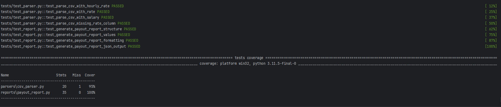

# Employee Salary Reports CLI

CLI-инструмент для генерации отчётов по зарплатам сотрудников из CSV-файлов.  
Разработан с учётом расширяемости, читаемости и покрытия тестами.

---
<details>
<summary><strong>Как запустить проект из архива</strong></summary>


1. **Распакуйте архив** в удобную папку:

   ```
   employee-report-cli/
   ├── main.py
   ├── models/
   ├── parsers/
   ├── reports/
   ├── tests/
   ├── README.md
   └── pytest.ini
   ```

2. **Создайте виртуальное окружение** и активируйте его:

   **Windows:**
   ```bash
   python -m venv .venv
   .venv\Scripts\activate
   ```

   **macOS / Linux:**
   ```bash
   python3 -m venv .venv
   source .venv/bin/activate
   ```

3. **Установите зависимости для тестов:**
   ```bash
   pip install pytest pytest-cov
   ```

4. **Запустите тесты с покрытием:**
   ```bash
   pytest -v --cov=parsers --cov=reports
   ```

5. **Запуск CLI для генерации отчёта:**
   ```bash
   python main.py data1.csv data2.csv data3.csv --report payout
   ```

   Убедитесь, что `data1.csv`, `data2.csv`, `data3.csv` находятся рядом с `main.py`.

</details>
---

##  Форматы вывода

По умолчанию отчёт отображается в виде таблицы, но также можно вывести его в формате JSON с помощью аргумента `--format`:

### ▶ Табличный формат (по умолчанию)

```bash
python main.py data1.csv data2.csv data3.csv --report payout
```

```
Marketing
                name              hours  rate   payout
--------------- Yuna Kim         160    50     $8000
                                        $8000

Design
                Haruka Tanaka    150    35     $5250
--------------- Miyu Sato        140    40     $5600
                                        $10850
```


### ▶ JSON формат 


```bash
python main.py data1.csv data2.csv data3.csv --report payout --format json
```

```
{
    "Marketing": {
        "employees": [
            {
                "name": "Yuna Kim",
                "department": "Marketing",
                "hours_worked": 160,
                "hourly_rate": 50,
                "payout": 8000
            }
        ],
        "total_payout": 8000
    },
    "Design": {
        "employees": [
            {
                "name": "Haruka Tanaka",
                "department": "Design",
                "hours_worked": 150,
                "hourly_rate": 35,
                "payout": 5250
            }
        ],
        "total_payout": 5250
    }
}
```

---

## Структура проекта

```
.
├── main.py
├── models/
│   └── employee.py
├── parsers/
│   └── csv_parser.py
├── reports/
│   └── payout_report.py
├── screenshots/
│   └── coverage.png
├── tests/
│   ├── test_parser.py
│   └── test_report.py
├── pytest.ini
└── README.md
```

---

## Тесты и покрытие


---

## Добавление новых отчётов

1. Создай файл `reports/<название>_report.py`
2. Добавь новую функцию генерации отчёта
3. Обнови `main.py`, добавив `if args.report == "<название>":`

---

## Используемые технологии

- Python 3.11+
- `argparse`
- `dataclasses`
- `pytest`
- `pytest-cov`

---
